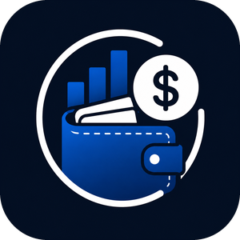

# Controle Financeiro

**Organize seu salário, seus vales e seus gastos — simples, sem anúncios e sem cadastro.**

---

## Por que eu fiz este app

Eu queria acompanhar para onde ia o dinheiro do mês sem depender de planilha e sem
aplicativo cheio de propaganda, assinatura e cadastro. Testei vários e sempre
esbarrava no mesmo problema: nenhum deles entendia como funciona o salário aqui.

Vale-alimentação e vale-transporte não são o mesmo dinheiro do salário. São valores
carimbados, que só servem para uma coisa. Quando o app soma tudo num saldo só, o
número que aparece é maior do que o que realmente dá para gastar — e aí a conta
não fecha no fim do mês.

Então fiz do meu jeito: cada coisa no seu lugar, e a resposta que interessa logo na
primeira tela — **quanto do que eu recebi ainda está comigo**.

---

## O que ele faz

**Entradas e despesas**
Registro de salário, rendas extras e gastos em poucos toques. Dá para lançar vários
itens seguidos sem sair da tela, e cada lançamento aceita uma observação.

**Carteiras separadas**
Conta bancária, vale-alimentação e vale-transporte com saldos independentes. Ao
lançar mercado, transporte ou combustível, dá para escolher de qual carteira saiu o
dinheiro.

**Relatórios que respondem alguma coisa**
Gráfico de despesas por categoria mostrando quanto por cento do que entrou já foi
gasto, resumo do mês, histórico completo e comparação entre meses e entre anos.

**Simulador de renda fixa**
Compara Poupança, Tesouro Selic, CDB e LCI/LCA lado a lado, com o imposto de renda
já descontado pela tabela regressiva, em prazos de 1 a 30 anos.

**Simulador de criptomoedas**
Bitcoin, Ethereum e Solana: informando o preço atual, mostra quanto o investimento
valeria em diferentes cenários, de uma queda pela metade até uma alta de 100x.

**Metas**
Objetivos financeiros com acompanhamento do progresso.

**Detalhes do dia a dia**
Tema claro e escuro, e um botão para ocultar os valores na tela quando tem gente por
perto.

---

## Privacidade

Este ponto para mim não é negociável:

- Nenhum dado é coletado. Não existe servidor guardando as suas informações.
- Nada é vendido nem compartilhado. Com ninguém.
- Sem cadastro, sem login, sem rastreador e sem anúncio.
- Tudo o que você registra fica salvo no seu próprio aparelho.

[Política de Privacidade completa](https://sandrolimadf1984.github.io/controle-financeiro/politica-de-privacidade.html)

---

## Como foi construído

HTML, CSS e JavaScript puro, em arquivo único, sem framework e sem biblioteca
externa. Empacotado para Android com Capacitor.

Duas decisões que valem explicar:

**Sem biblioteca de gráficos.** Testei algumas, e todas pesavam mais que o app
inteiro e precisavam de internet para carregar. Como os gráficos aqui são simples,
montei em SVG na mão. Ficou mais leve e o app continua funcionando offline.

**Dados só no aparelho.** Não usei nuvem nem banco de dados. Além de resolver a
questão da privacidade de forma definitiva, elimina servidor, custo e uma porção de
coisas que poderiam falhar.

### Organização do código

O arquivo é único, mas dividido em blocos:

| Bloco | O que tem |
|---|---|
| 1. Configuração | categorias, carteiras e as regras que ligam uma à outra |
| 2. Estado | dados em memória e gravação no aparelho |
| 3. Formatação | dinheiro, datas, números e cores |
| 4. Cálculos | resumos do mês, saldos e agrupamentos |
| 5. Telas | cada tela monta o próprio HTML |
| 6. Formulários | lançamento de entradas, despesas e metas |
| 7. Ajustes | tema, backup e preferências |
| 8. Navegação | troca de telas e botão voltar do aparelho |
| 9. Inicialização | ponto de entrada |

Nomes de código em inglês, comentários em português. Onde a solução não é óbvia,
deixei uma observação explicando o motivo da escolha — para quando eu voltar nesse
arquivo daqui a seis meses e não lembrar por que fiz daquele jeito.

---

## Plataformas

- **Android** — aplicativo instalável
- **Navegador** — funciona em qualquer computador ou celular

---

## Autor

Desenvolvido por **Sandro** — [@sandrolimadf1984](https://github.com/sandrolimadf1984)

Desenvolvedor autodidata de Brasília, com experiência em desenvolvimento Full Stack,
análise de sistemas e automação de processos.

Contato: aquilesdodf@gmail.com

---

## Aviso

Os simuladores têm finalidade educativa. Os resultados são projeções baseadas nos
valores informados e nas regras de tributação vigentes — não são recomendação de
investimento. Rentabilidade passada não garante rentabilidade futura, e
criptomoedas são ativos de altíssimo risco.

---

**© 2026 Sandro — Todos os direitos reservados.**

